<div align="center">

# Om Pandey


</div>

<div align="center">
  
</div>

<div align="center">

[](https://www.omkumarpandey.com.np/)
[](https://www.linkedin.com/in/om-pandey-647844305/)
[](mailto:iamompandey.it@gmail.com)
[](https://finixdev.com)

</div>

---

## 🎯 What I Do

<table>
<tr>
<td width="50%">

### 💻 Full Stack Development
Building responsive web applications with React/Next.js frontends and robust Node.js/Django backends. Focus on clean code and maintainable architecture.

### 🏗️ System Architecture
Designing scalable systems that handle high traffic and concurrent users. Microservices, API design, and database optimization.

</td>
<td width="50%">

### ⚙️ DevOps & Infrastructure
Docker containerization, CI/CD pipelines, and cloud deployment. Automating everything from testing to production.

### 🚀 Product Development
End-to-end ownership from initial concept to production deployment. Technical leadership and project management.

</td>
</tr>
</table>

---

## 🛠️ Tech Stack

<div align="center">

### Frontend Development


### Backend & Database


### DevOps & Tools


</div>

```javascript
const omPandey = {
    location: "Nepal",
    company: "Finix Dev",
    role: "Founder & Full Stack Developer",
    expertise: ["React", "Next.js", "Node.js", "Django", "DevOps"],
    currentFocus: "Building scalable SaaS platforms",
    openTo: ["Contract Work", "Technical Consulting", "Collaboration"]
};
```

---

## 📊 GitHub Stats & Activity

<div align="center">
  
  
</div>

<div align="center">
  
</div>

<div align="center">
  
</div>

<div align="center">
  
</div>

---

## 💼 Development Approach



<div align="center">

```mermaid
graph LR
    A[📋 Requirements] --> B[🎨 Design]
    B --> C[⚙️ Architecture]
    C --> D[💻 Development]
    D --> E[🧪 Testing]
    E --> F[🚀 Deployment]
    F --> G[📊 Monitoring]
    
    style A fill:#238636,stroke:#58a6ff,stroke-width:2px
    style B fill:#238636,stroke:#58a6ff,stroke-width:2px
    style C fill:#238636,stroke:#58a6ff,stroke-width:2px
    style D fill:#238636,stroke:#58a6ff,stroke-width:2px
    style E fill:#238636,stroke:#58a6ff,stroke-width:2px
    style F fill:#238636,stroke:#58a6ff,stroke-width:2px
    style G fill:#238636,stroke:#58a6ff,stroke-width:2px
```

### ⚡ Core Principles

<table>
<tr>
<td align="center" width="33%">

<br><sub>Maintainable & readable</sub>
</td>
<td align="center" width="33%">

<br><sub>Built to grow</sub>
</td>
<td align="center" width="33%">

<br><sub>Optimized at every layer</sub>
</td>
</tr>
</table>

</div>

---

## 🤝 Open For

<div align="center">

```diff
+ Contract work for full-stack development projects
+ Technical consulting on architecture and scalability  
+ Collaboration on interesting open-source projects
+ Long-term partnerships with growing startups
```

</div>

---

<div align="center">

### 💡 *"Write code that speaks for itself, build systems that scale"*


</div>
