<div align="center">

# 𝕆𝕞 ℙ𝕒𝕟𝕕𝕖𝕪

**Senior IT @ Pioneer Software Solutions | Software Developer @ Mega Minds Pvt Ltd**

*Building production-grade applications with modern tech stack*  
*Specialized in scalable architecture & end-to-end development*

</div>

<div align="center">

[](https://www.omkumarpandey.com.np/)
[](https://www.linkedin.com/in/om-pandey-647844305/)
[](mailto:iamompandey.it@gmail.com)

</div>

---

## 🎯 What I Do

<table>
<tr>
<td width="50%">

### 💻 Full Stack Development
Building responsive web applications with React/Next.js frontends and robust Node.js/Django backends. Focus on clean code and maintainable architecture.

### 🏗️ System Architecture
Designing scalable systems that handle high traffic and concurrent users. Microservices, API design, and database optimization.

</td>
<td width="50%">

### ⚙️ DevOps & Infrastructure
Docker containerization, CI/CD pipelines, and cloud deployment. Automating everything from testing to production.

### 🚀 Product Development
End-to-end ownership from initial concept to production deployment. Technical leadership and project management.

</td>
</tr>
</table>

---

## 🛠️ Tech Stack

<div align="center">

### Frontend Development


### Backend & Database


### DevOps & Tools


</div>

```javascript
const omPandey = {
    location: "Nepal",
    currentRoles: [
        "Senior IT @ Pioneer Software Solutions",
        "Software Developer @ Mega Minds Pvt Ltd"
    ],
    expertise: ["React", "Next.js", "Node.js", "Django", "DevOps"],
    currentFocus: "Building scalable SaaS platforms",
    openTo: ["Contract Work", "Technical Consulting", "Collaboration"]
};
```

---

## 🏆 Professional Experience & Expertise

<div align="center">

<table>
<tr>
<td align="center" width="50%">
<h3>🏢 Pioneer Software Solutions</h3>

<br/><br/>
<p align="left">
• Leading full-stack development projects<br/>
• System architecture & infrastructure design<br/>
• Team collaboration & technical mentorship<br/>
• DevOps pipeline implementation
</p>
</td>
<td align="center" width="50%">
<h3>💼 Mega Minds Pvt Ltd</h3>

<br/><br/>
<p align="left">
• Building scalable web applications<br/>
• API development & integration<br/>
• Database optimization & design<br/>
• Code review & quality assurance
</p>
</td>
</tr>
</table>

</div>

### 💡 Key Competencies

<div align="center">

| Domain | Technologies | Impact |
|--------|-------------|---------|
| **Frontend** | React, Next.js, TypeScript, Tailwind | High-performance UIs, 60+ FPS animations |
| **Backend** | Node.js, Django, Express, REST APIs | Scalable microservices, 10K+ concurrent users |
| **Database** | PostgreSQL, MongoDB, Redis | Optimized queries, 40% faster response time |
| **DevOps** | Docker, AWS, CI/CD, Nginx | Automated deployments, 99% uptime |
| **Architecture** | System Design, Microservices, API Design | Enterprise-grade solutions, fault-tolerant systems |

</div>

---

## 🎯 Current Focus & Projects

<div align="center">

```ascii
┌─────────────────────────────────────────────────────────────────┐
│  Working on scalable SaaS platforms & enterprise solutions      │
│  Exploring AI integration, microservices & cloud architecture   │
└─────────────────────────────────────────────────────────────────┘
```

</div>

<table>
<tr>
<td width="33%" align="center">

<br/><br/>
<sub>Building multi-tenant applications with role-based access, payment integration, and real-time features</sub>
</td>
<td width="33%" align="center">

<br/><br/>
<sub>Architecting large-scale systems with microservices, API gateways, and distributed databases</sub>
</td>
<td width="33%" align="center">

<br/><br/>
<sub>Optimizing response times, implementing caching strategies, and reducing infrastructure costs</sub>
</td>
</tr>
</table>

### 🔧 Recent Technical Achievements

<div align="center">

| Achievement | Technology | Result |
|-------------|-----------|---------|
| Built real-time monitoring dashboard | React + WebSocket + Node.js | Live tracking of 50+ metrics |
| Implemented CI/CD pipeline | Docker + GitHub Actions | 80% faster deployment |
| Optimized database queries | PostgreSQL + Indexing | 3x faster API responses |
| Developed payroll automation | Django + Celery | Automated processing for 500+ employees |
| Created microservices architecture | Node.js + Redis + RabbitMQ | Handled 10K+ concurrent requests |

</div>

---

## 💻 Code & Collaboration

```mermaid
graph LR
    A[📋 Requirements] --> B[🎨 Design]
    B --> C[⚙️ Architecture]
    C --> D[💻 Development]
    D --> E[🧪 Testing]
    E --> F[🚀 Deployment]
    F --> G[📊 Monitoring]
    
    style A fill:#238636,stroke:#58a6ff,stroke-width:2px
    style B fill:#238636,stroke:#58a6ff,stroke-width:2px
    style C fill:#238636,stroke:#58a6ff,stroke-width:2px
    style D fill:#238636,stroke:#58a6ff,stroke-width:2px
    style E fill:#238636,stroke:#58a6ff,stroke-width:2px
    style F fill:#238636,stroke:#58a6ff,stroke-width:2px
    style G fill:#238636,stroke:#58a6ff,stroke-width:2px
```

<div align="center">
  
  
</div>



<div align="center">

### ⚡ Core Principles

<table>
<tr>
<td align="center" width="33%">

<br><sub>Maintainable & readable</sub>
</td>
<td align="center" width="33%">

<br><sub>Built to grow</sub>
</td>
<td align="center" width="33%">

<br><sub>Optimized at every layer</sub>
</td>
</tr>
</table>

</div>

---

## 🤝 Open For

<div align="center">

```diff
+ Contract work for full-stack development projects
+ Technical consulting on architecture and scalability  
+ Collaboration on interesting open-source projects
+ Long-term partnerships with growing startups
```

</div>

---

<div align="center">

### 💡 *"Write code that speaks for itself, build systems that scale"*


</div>
