```mermaid
graph TD
    A[🎯 Client Requirements] --> B[🏗️ System Design]
    B --> C[🎨 Frontend Development]
    B --> D[⚙️ Backend Architecture]
    B --> E[🗄️ Database Design]
    C --> F[⚛️ React/Next.js]
    D --> G[🟢 Node.js/Python]
    E --> H[🍃 MongoDB/PostgreSQL]
    F --> I[🚀 Deployment]
    G --> I
    H --> I
    I --> J[🔄 DevOps Pipeline]
    J --> K[📊 Monitoring & Scaling]
    
    style A fill:#FF5733,stroke:#fff,stroke-width:2px,color:#fff
    style B fill:#00D4FF,stroke:#fff,stroke-width:2px,color:#000
    style F fill:#61DAFB,stroke:#fff,stroke-width:2px,color:#000
    style G fill:#339933,stroke:#fff,stroke-width:2px,color:#fff
    style H fill:#47A248,stroke:#fff,stroke-width:2px,color:#fff
    style I fill:#FF6B35,stroke:#fff,stroke-width:2px,color:#fff
    style J fill:#2496ED,stroke:#fff,stroke-width:2px,color:#fff
    style K fill:#FFD700,stroke:#fff,stroke-width:2px,color:#000
```

# 
👋 Hello, I'm Om Pandey

  

  

---

## 🚀 About Me - Building Digital Excellence

🔹 **Founder & CEO** of **[Finix Dev](https://finixdev.com)** - Transforming Ideas into Scalable Solutions  
🔹 **Full Stack Developer** specializing in **MERN Stack & Next.js**  
🔹 **DevOps Engineer** with expertise in **CI/CD, Docker & Cloud Deployment**  
🔹 **UI/UX Designer** proficient in **Adobe Illustrator & Creative Suite**  
🔹 **Tech Innovator** passionate about **AI, Blockchain & Emerging Technologies**  

> *"Code is poetry written in logic, and I'm here to craft masterpieces that solve real-world problems."*

---

## 💼 Business Impact & Professional Highlights

  

  <table>
    <tr>
      <td align="center">
        
      </td>
      <td align="center">
        
      </td>
      <td align="center">
        
      </td>
    </tr>
  </table>

### 🎯 What I Deliver:
- ✅ **Enterprise-grade applications** with 99.9% uptime
- ✅ **Scalable architectures** handling 10K+ concurrent users  
- ✅ **Cost-effective solutions** reducing operational expenses by 35%
- ✅ **Modern UI/UX designs** increasing user engagement by 60%
- ✅ **Complete DevOps pipelines** with automated deployment

---

## 🛠️ Technical Arsenal

  

### **Frontend Development**

  

### **Backend Development** 

  

### **DevOps & Cloud**

  

### **Design & Tools**

  

---

## 📊 GitHub Analytics

  
  

  

---

## 🏗️ Architecture & Development Approach

  

  
  
  

 

  
  
  
  
  

---

## 🎨 Design Philosophy

  

### **My Creative Process:**
🎯 **User-Centric Design** → 🎨 **Adobe Illustrator Mockups** → 💻 **Responsive Development** → 🚀 **Performance Optimization**

---

## 🌟 Core Competencies Matrix

<table align="center">
  <tr>
    <th>🔥 Expertise Level</th>
    <th>⚡ Technology Stack</th>
    <th>💼 Business Value</th>
  </tr>
  <tr>
    <td><strong>Expert (90%+)</strong></td>
    <td>React, Next.js, Node.js, Python, MongoDB</td>
    <td>Rapid MVP development, Scalable solutions</td>
  </tr>
  <tr>
    <td><strong>Advanced (80%+)</strong></td>
    <td>Django, PostgreSQL, Docker, AWS, Adobe Suite</td>
    <td>Enterprise applications, Brand design</td>
  </tr>
  <tr>
    <td><strong>Proficient (70%+)</strong></td>
    <td>TypeScript, GraphQL, Kubernetes, DevOps</td>
    <td>Type-safe apps, API optimization</td>
  </tr>
</table>

---

## 🚀 Featured Projects & Solutions

  
  

### 🏆 **Project Highlights:**
- **🛒 E-commerce Platform**: MERN stack with Stripe integration, handling $100K+ transactions
- **📊 Analytics Dashboard**: React + D3.js visualization processing 1M+ data points
- **🏦 FinTech Application**: Next.js + PostgreSQL with advanced security features
- **🎨 Design System**: Adobe Illustrator components used across 5+ major projects

---

## 💡 Innovation & Problem Solving

  

### **My Development Methodology:**
1. **🔍 Problem Analysis** - Deep dive into business requirements
2. **🏗️ Architecture Design** - Scalable, maintainable system design  
3. **⚡ Rapid Prototyping** - Quick MVP development for validation
4. **🎨 Design Integration** - Seamless UI/UX implementation
5. **🚀 Performance Optimization** - Speed, security, and scalability
6. **📈 Continuous Improvement** - Iterative enhancement based on metrics

---

## 🤝 Let's Build Something Amazing Together

  
  
  
  
  
  

### **🎯 Open for:**
- 💼 **Freelance Projects** - Full-stack web applications
- 🤝 **Collaborations** - Open source contributions  
- 💡 **Consulting** - Technical architecture and strategy
- 🚀 **Partnerships** - Long-term business relationships

---

## 📈 Why Choose Om Pandey?

  <table>
    <tr>
      <td align="center">
        
         <strong>Proven Track Record</strong>
      </td>
      <td align="center">
        
         <strong>Portfolio Excellence</strong>
      </td>
      <td align="center">
        
         <strong>Client Success</strong>
      </td>
    </tr>
  </table>

---

  

---

  <h3>💫 "Transforming Ideas into Digital Reality - One Line of Code at a Time" 💫</h3>
  
  
  
  ⭐ **Star my repositories if you find them helpful!** ⭐

